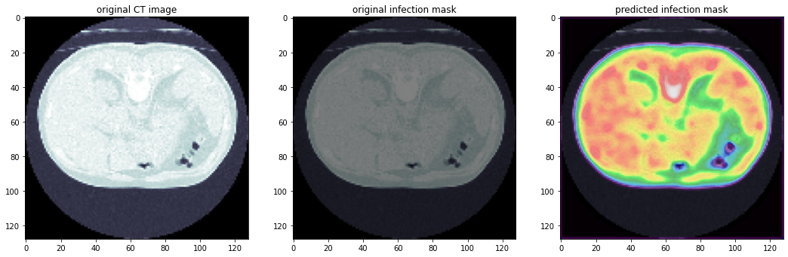

# Lung Segmentation for COVID-19 CT Scans

This project implements an Attention U-Net model to segment lung regions and infection masks from COVID-19 CT scans.

## Features
- Convert `.nii` files to `.png` for preprocessing.
- Train an Attention U-Net model on CT scans and lung masks.
- Visualize predictions with original CT images and ground truth masks.

## Installation
1. Clone the repository:
   ```bash
   git clone https://github.com/AmirFeiz2001/lung_segmentation_covid19.git
   cd lung_segmentation_covid19

2. Install dependencies:
   ```bash
   pip install -r requirements.txt

## Installation
1. Clone the repository:
   ```bash
   python main.py --data_dir /path/to/data --output_dir /path/to/output --epochs 50

## Data
The dataset should be organized as:
```bash
   data/
   ├── ct_scans/
   ├── lung_mask/
   ├── infection_mask/
   ├── lung_and_infection_mask/
```
   

## Results of the model

